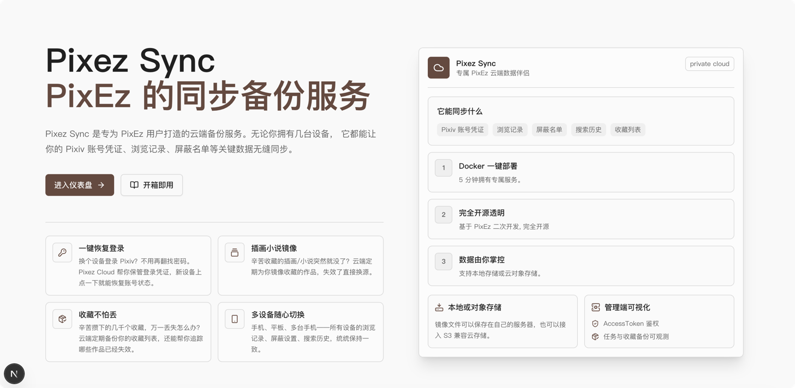
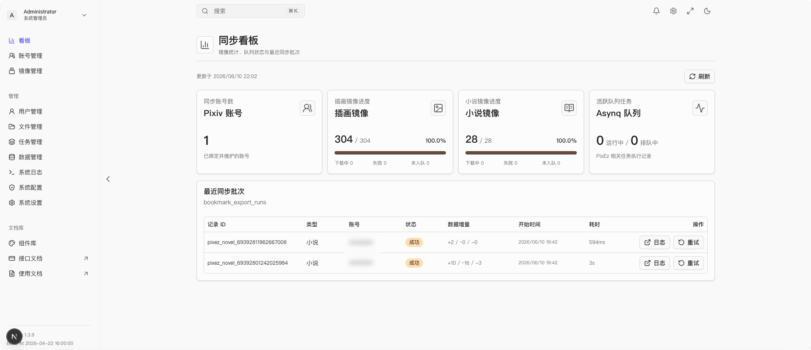

# Pixiv Sync

为 Pixiv 用户打造的云端备份与同步服务

[](https://www.gnu.org/licenses/agpl-3.0.html)
[](https://golang.org/)
[](https://nextjs.org/)
[](https://reactjs.org/)

Pixiv Sync 是专为 Pixiv 和 PixEz 用户打造的云端数据伴侣。从此，你再也不用担心插画突然变灰, 消除, 不公开了。无论是插画还是小说，Pixiv Sync 都能帮你安全地备份和同步到云端。



## 它能为你做什么

### 📦 收藏不怕丢

辛苦攒下的几千个收藏，万一丢失怎么办？云端定期备份你的收藏列表，还能帮你追踪哪些作品已经失效。

### 🖼️ 插画安全存储

不再担心插画被删除或变灰了。Pixiv Sync 会自动下载并存储你收藏的插画，确保它们永远在你手中。

### 📚 小说也能备份

不仅是插画，Pixiv Sync 还支持备份你收藏的小说。无论是短篇还是长篇，都能安全存储在云端。

### 🔄 多设备同步(仅PixEz 支持)

账号一键还原, 个性化数据一键同步, 无论是新设备还是旧设备, 都能轻松同步你的收藏和数据。





## 快速开始

### Docker Compose 部署

```yaml
services:
  wavelet:
    image: ghcr.io/rain-kl/pixezsync:latest
    restart: unless-stopped
    env_file: .env
    environment:
      TZ: ${TZ:-Asia/Shanghai}
    ports:
      - "8061:8061"
    volumes:
      - ./uploads:/app/uploads
      - ./data/:/app/data
    depends_on:
      redis:
        condition: service_healthy

  redis:
    image: redis:7-alpine
    restart: unless-stopped
    command: ["redis-server", "--appendonly", "yes"]
    volumes:
      - ./data/redis_data:/data
    healthcheck:
      test: ["CMD", "redis-cli", "ping"]
      interval: 10s
      timeout: 5s
      retries: 5
      start_period: 5s
```

下载仓库的 .env.example 文件到本地：

```bash
cp .env.example .env
```

- 将 `APP_SESSION_SECRET` 改为足够长的随机字符串。
- 本地 HTTP 测试时设置 `APP_SESSION_SECURE=false`。
- 只有在 HTTPS 部署时保留 `APP_SESSION_SECURE=true`。

启动服务：

```bash
docker compose up -d
```

初始本地管理员账号：

```text
username: admin
password: 12345678
```
### 添加 Pixiv 账号

- 方案一: 登录管理员账号后，进入账号管理页面，点击 "添加 Pixiv 账号" 按钮，完成账号授权流程。授权成功后，系统会自动开始备份和同步该账号的数据。
- 方案二: 使用 PixEz 连接 Pixiv Sync，登录 PixEz 后，在设置页面找到 "数据同步" 选项，输入 Pixiv Sync 的地址和访问令牌，完成连接。连接成功后，PixEz 会自动同步你的账号数据到 Pixiv Sync。

## 使用 PixEz

下载修改版的 PixEz Flutter 客户端，安装到设备上：

地址: https://github.com/Rain-kl/pixez-flutter/releases

1. 登录 Pixez Sync Web 管理端。
2. 点击个人用户->设置->访问令牌(/settings/access-token)，创建 AccessToken。
3. 在 PixEz 的自定义数据同步设置页填写服务器地址。
4. 地址示例：`https://pixez.example.com`。
5. 粘贴 AccessToken, 验证连接 , 完成首次数据同步。

## 系统架构

```text
PixEz Flutter custom layer
  |
  |  Authorization: Bearer <access_token>
  v
PixEzServer
  |-- /api/pixez/**        Wavelet envelope 包裹的业务接口
  |-- /mirror/**           Pixiv 形态镜像读取和图片流
  |-- /api/v1/admin/tasks  任务下发、重试、调度和日志
  |
  v
internal/service/pixez
  |-- Pixiv App API client 与 token refresh
  |-- sync-data 备份与 hash 对比
  |-- 插画 / 小说镜像处理
  |-- 收藏导出与 removed 状态追踪
  |
  v
GORM models + goose migrations + uploads + task_executions
  |
  v
Redis / Asynq worker + 本地磁盘或 S3 兼容存储
```

## 核心能力

### Pixiv 账号同步

PixEz Flutter 可以上报 Pixiv 用户信息、access token、refresh token、device token、会员标记和限制标记。后端保存到 `pixiv_users`，对外提供不含 token 的用户列表，并在客户端需要一键恢复登录时返回完整凭证。

### 本地数据备份

同步 API 会按 Pixiv 用户保存 7 张 PixEz 本地表：

- `ban_comments`
- `ban_illusts`
- `ban_tags`
- `ban_users`
- `illust_histories`
- `novel_histories`
- `tag_histories`

Hash 接口用于让客户端跳过未变化的表，避免每次全量上传。

### 插画镜像

`POST /api/pixez/illusts/:illust_id/mirror` 会幂等下发 Asynq 任务。Worker 请求 Pixiv `v1/illust/detail`，下载 original 图片，经 Wavelet Upload 存储写入本地或 S3，并把映射保存到 `mirror_illust`。

`/mirror/v1/illust/detail` 返回 Pixiv 形态详情 JSON，并把 pximg 域名改写到 `/mirror/pximg`；`/mirror/pximg/*path` 优先流式输出已缓存文件，未命中时可回退代理 Pixiv 原始地址。

### 小说镜像

`POST /api/pixez/novels/:novel_id/mirror` 会下发小说镜像任务。Worker 保存 Pixiv `v2/novel/detail` 与 `webview/v2/novel` 原始 JSON 到 `mirror_novel`。

Flutter custom 层可以在小说详情页打开时自动入队镜像，该行为由客户端“自动镜像小说”同步设置控制。

### 收藏导出与失效追踪

后台任务按 public/private 分页导出插画和小说收藏。导出规则是增量式的：

- 新作品插入数据库。
- 已存在且仍 active 的记录，只更新本轮运行 ID 和最近出现时间。
- 包含 `limit_unknown_360`、`limit_unknown_100` 等占位图的作品立即标记 removed。
- 只有整轮分页成功结束后，才把本轮未出现的历史 active 记录标记为 removed。
- 分页中途失败时不做缺失标记，避免误判。

PixEz 管理界面基于这些 read-model 展示镜像进度、失败项、不可见作品和最近导出批次。

### 任务与运维控制台

PixEz 任务接入 Wavelet Admin 任务体系：

| Admin task type |  用途 |
| --- |  --- |
| `pixez_mirror` | 镜像单个插画或小说 |
| `pixez_export_bookmarks` |  导出收藏 read-model 并维护 removed 状态 |
| `pixez_auto_enqueue_bookmark_mirrors` |  扫描未镜像或失败的收藏条目并批量入队 |

## 友情链接

- [LINUX DO](https://linux.do/) —— 新的理想型社区，技术爱好者的聚集地。


## License

This project is licensed under the [GNU Affero General Public License v3.0](LICENSE).

## Star History

<a href="https://www.star-history.com/?repos=Rain-kl%2FPixezSync&type=date&legend=top-left">
 <picture>
   <source media="(prefers-color-scheme: dark)" srcset="https://api.star-history.com/chart?repos=Rain-kl/PixezSync&type=date&theme=dark&legend=bottom-right" />
   <source media="(prefers-color-scheme: light)" srcset="https://api.star-history.com/chart?repos=Rain-kl/PixezSync&type=date&legend=bottom-right" />
   
 </picture>
</a>