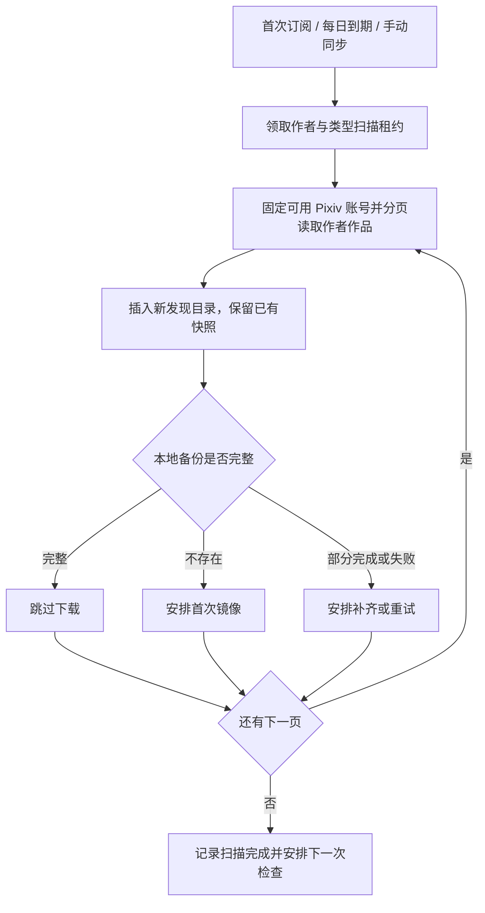

# 订阅管理设计文档

日期：2026-10-08。阶段：需求与方案设计，尚未实现。

## 1. 已确认的需求

- 侧边栏在「镜像管理」下方新增「订阅管理」，统一使用这个名称。
- 订阅管理分为「小说订阅」「插画订阅」两个标签页，均展示已订阅和未订阅作者。
- 作者目录与订阅全站共享，不按登录用户隔离。
- 从现有插画、小说镜像中提取作者，按 Pixiv 作者 ID 去重归类。
- 点击作者查看其作品，并支持订阅插画、小说，或者同时订阅两者。
- 新订阅立即扫描该类型的历史作品，此后每天自动检查一次，支持手动同步。
- 完整备份的作品跳过；部分失败只补齐缺失内容。
- 同步以新增备份为原则。作品在 Pixiv 隐藏、删除或不可访问，不能覆盖或删除已有备份。
- 取消订阅停止后续自动同步，保留作者、作品目录及已有备份。

## 2. 范围与基本定义

「所有作者」指本系统已从镜像中发现的作者，以及系统已有订阅的作者，不是枚举整个 Pixiv 的作者。不要求用户必须先收藏作者的全部作品。

「全部作品」指当前可用 Pixiv 账号能够访问的作者作品，加上本地已经保存的历史作品。已隐藏且从未备份的作品无法凭空恢复；页面展示的是「已发现作品数」，不宣称它等于作者历史发表总数。

作者详情合并展示在线已发现作品和本地备份，并区分未备份、处理中、部分完成、完整备份、失败，以及最近扫描未返回等状态。访问作者详情可触发后台刷新目录，不会自动订阅或下载正文、原图。

小说与插画订阅独立。同一作者可以出现在两栏：只订阅小说不下载其插画；开启两者时分别维护扫描进度和失败状态。插画类别沿用现有镜像器支持的作品范围；漫画多页作品按现有能力处理，动图格式转换等新媒体能力不纳入本次开发。

## 3. 现有实现与影响

| 现有位置 | 当前行为 | 本次设计的影响 |
| --- | --- | --- |
| `frontend/components/layout/sidebar.tsx` | 已有镜像管理、收藏管理入口 | 在镜像管理之后增加订阅管理 |
| `internal/model/pixez_mirror.go` | 插画、小说分别以作品 ID 全站唯一 | 继续复用备份，不为每个订阅复制资源 |
| `internal/service/pixez/mirror.go` | 详情保存在 JSON 中，执行任务会更新结果 | 建立统一的完整性判断和已有内容保护机制 |
| 同上 | 插画保存部分图片时可能仍标为 success | 不能仅按 success 判断是否需要补齐 |
| 同上 `latestMirrorUser` | 使用最近更新的已保存 Pixiv 账号 | 首版沿用，单次扫描固定账号，明确记录认证失败 |
| `internal/apps/pixez/tasks.go` | 已有单作品镜像任务及任务管理框架 | 新增作者扫描与每日调度任务，复用下载链路 |
| `internal/router/root/custom.go` | `/api/pixez` 使用登录鉴权 | 新接口沿用鉴权与全站共享管理方式 |

现有收藏表记录用户收藏事实。订阅作者的新作品不能插入收藏表，也不能覆盖已有收藏原始字段、`illust_json` 或 `novel_json`。

## 4. 页面与交互

### 4.1 订阅管理 `/pixez/subscriptions`

标签页按「小说订阅」「插画订阅」展示。每栏包含：

- 搜索作者名称、Pixiv 作者 ID。
- 筛选全部、已订阅、未订阅、同步异常。
- 作者头像、名称、ID、该类型本地完整备份数、已发现作品数。
- 订阅状态、最近成功扫描时间、同步进度或最近错误。
- 查看作品、订阅/取消订阅、立即同步。

在小说栏开启的是小说订阅，在插画栏开启的是插画订阅。同一作者的另一种订阅状态在作者详情中展示，用户可以在那里分别开关两者。

未订阅作者同样可查看已有备份及刷新作品目录。「立即同步」用于已经开启的该类型订阅；未订阅时显示「订阅并同步」，避免产生无法追踪的临时订阅行为。

取消订阅说明：「停止该类型的自动同步，已有备份继续保留。」取消某一种类型不影响另一种类型。

### 4.2 作者详情 `/pixez/subscriptions/artist?artist_id=...&type=...`（兼容静态嵌入发布）

展示作者资料、两种独立的订阅开关，以及插画/小说作品列表。默认作品类型与进入时的标签页一致。

作品列表使用本地目录分页，展示封面或本地预览、标题、作品 ID、备份完整性。完整备份直接打开现有本地阅读或图片详情；原站不可访问时仍允许访问本地备份。未备份内容只展示已发现的概要，不把原站预览当作已完成备份。

提供刷新目录、按备份状态筛选、扫描进度和错误提示。网络失败时继续展示本地目录，提示刷新失败，不清空列表。

## 5. 数据模型

建议新增以下业务表，并保留已有镜像表作为实际内容与资源映射的权威来源。所有关系通过字段和索引建立，不增加物理外键。

### 5.1 `pixez_artists`：作者目录

| 字段 | 用途 |
| --- | --- |
| `artist_id` | Pixiv 作者 ID，主键 |
| `name`, `avatar_url` | 展示资料；有可信资料时可更新，空值不清除已有资料 |
| `first_seen_at`, `last_seen_at` | 首次发现和最近发现时间 |
| `created_at`, `updated_at` | 记录时间 |

作品里的原始作者名称保留在首次作品快照中。作者展示资料变化不改写历史作品元数据。

### 5.2 `pixez_artist_works`：作者作品目录

| 字段 | 用途 |
| --- | --- |
| `id` | 内部主键 |
| `artist_id` | 作者 ID，建立查询索引 |
| `target_type`, `target_id` | illust/novel 与作品 ID，组合唯一 |
| `first_summary_json` | 首次可信列表概要，只在新建时写入 |
| `first_seen_at`, `last_seen_at` | 发现时间 |
| `last_seen_run_id` | 最近发现本作品的扫描轮次 |
| `last_observation` | seen / not_returned，独立于本地备份状态 |
| `discovered_from_mirror`, `discovered_from_scan` | 来源标记，可追加 |
| `created_at`, `updated_at` | 记录时间 |

作者作品目录通过类型和 ID 查询已有镜像记录，计算本地备份状态，不在目录表复制图片映射、正文或另一份备份状态。首次概要不是完整备份，后续抓取到的完整详情保存在镜像表。

索引：`UNIQUE(target_type, target_id)`、`(artist_id, target_type, id)`、`(artist_id, target_type, last_seen_run_id)`。

### 5.3 `pixez_artist_subscriptions`：类型独立的订阅

| 字段 | 用途 |
| --- | --- |
| `id` | 内部主键 |
| `artist_id`, `target_type` | 组合唯一，每位作者最多两条 |
| `enabled` | 是否开启该类型订阅 |
| `revision` | 配置版本，用于阻止取消后旧扫描继续下发任务 |
| `last_attempt_at`, `last_success_at`, `next_due_at` | 调度与最近成功完整扫描时间 |
| `last_error` | 最近错误的安全摘要 |
| `active_run_id`, `lease_expires_at` | 当前扫描轮次和可恢复的执行租约 |
| `created_at`, `updated_at` | 记录时间 |

取消订阅只关闭 enabled、递增 revision，不删除订阅历史。索引：`UNIQUE(artist_id, target_type)`、`(enabled, next_due_at)`。

### 5.4 `pixez_artist_sync_runs`：扫描记录

保存订阅 ID、作者 ID、作品类型、订阅版本、触发来源（首次/每日/手动）、使用的 Pixiv 账号 ID、状态、分页游标、开始/完成时间、发现/新增/跳过/待补齐/下发计数、失败摘要及任务 ID。

扫描完成与作品下载完成分开显示：扫描完成表示分页结束、作品已发现并安排处理，不表示所有文件都下载完成。下载进度从关联的现有任务框架和镜像记录汇总。

## 6. 作者初始化与后续归类

新增一个可重复执行、分页处理的作者索引回填任务：

1. 读取已有插画、小说镜像中的可信详情，提取作者 ID、名称和作品 ID。
2. 按作者 ID 插入作者目录；作者已有资料时保留有效资料。
3. 按作品类型和作品 ID 插入作品目录，登记镜像来源。
4. 作者没有有效 ID 或详情无法解析时记录问题和数量，跳过异常项，不凭名称合并作者。
5. 不自动开启任何订阅，不下载新作品，也不改写原镜像详情。

以后每次获得可信镜像详情，登记作者和作品关系。失败镜像如已有可信详情也可归类，但在页面中如实显示失败或部分完成。

小说栏显示发现过小说的作者，以及存在小说订阅记录的作者；插画栏同理。因此仅有插画记录且没有小说订阅记录的作者，最初只出现在插画栏，但可在详情中开启小说订阅。即使取消订阅，该作者仍保留可见。

## 7. 扫描与每日同步

新增作者扫描客户端方法。小说分页读取作者小说，插画分页覆盖现有镜像器支持的插画类别；具体 Pixiv 端点和返回结构在实现时通过官方客户端已有响应或测试样本验证，不把未验证的上游结构写死为已知事实。

只跟随经过校验的 Pixiv API 分页链接：校验 HTTPS、主机、作者及作品类型参数，避免将任意 URL 当作携带凭据的请求目标。

复用任务框架注册两类任务：每日到期订阅调度、单作者单类型分页扫描。下载继续走单作品处理链路，但必须补齐第 8 节的保护机制后才能用于订阅。

调度任务定期检查到期订阅，每个订阅正常情况下每 24 小时扫描一次；记录时间使用 UTC，页面按用户时区展示。首次订阅立即执行，正常完成或耗尽本轮重试后设置下一次到期时间，避免同一失败订阅被调度器无限循环触发。手动同步允许额外执行，但同一作者同一类型已有扫描时返回当前进度。

首次扫描和每日扫描均完成分页，不能遇到第一条已备份作品就提前结束，以免漏掉置顶调整、较早作品重新公开或之前未备份的作品。大批历史作品分批下发、限速并支持游标续跑。

扫描批次提交后保留游标。重复页依靠唯一约束去重；持久化任务记录及补偿检查保证队列暂时不可用时可重新下发未安排完成的作品。游标失效时允许从第一页重扫，不能跳过未发现的历史作品。

认证失效、限流和临时网络故障采用有上限的退避重试；账号不可用时明确报告错误。保留既有镜像并继续展示本地数据。在线目录缺项不能直接推断作品已经删除；仅在完整、成功的同类型扫描结束后标为本轮未返回，不改变本地可读性。

取消订阅后，旧扫描根据 enabled 和 revision 停止发现、下发新作品任务；已经在下载的单作品任务允许完成，避免丢弃已取得的数据。重新订阅立即扫描，仍按完整性跳过已备份作品。

## 8. 去重与备份保护：必须统一执行的规则

### 8.1 “完整备份”的判定

- 插画：存在可信详情，预期各页均有有效的 Upload 映射且存储对象可用，没有缺失页；不能仅检查 status=success。
- 小说：可信详情和正文快照均存在且能解析，不把空字段或错误响应视作完整。
- 文件完整性优先使用现有存储框架提供的验证信息；疑似缺失时按需检查，不在每日扫描对全部完整备份重复下载或全量读取文件。
- queued/processing 且执行租约有效的作品复用当前任务，不再并行下发。

### 8.2 新增与补齐的边界

首次备份允许写入新的详情、正文和文件映射。已有有效快照之后，自动扫描不得用上游的新响应替换原始详情、正文或有效文件映射；这包括作品标题、作者名改变，以及上游返回隐藏占位内容的情况。

部分失败的插画只追加缺失页的文件映射，保留已有成功页。优先使用已保存的可信原始详情和图片地址；必要时从上游取得补齐地址，但不以新响应替换历史快照。小说失败重试只填入缺失的有效详情或正文，不清空已有内容。

任务状态、错误、重试计数、扫描时间等运行信息可以更新；“只新增”针对持久备份内容，并不禁止更新任务进度。

上游隐藏、删除、账号权限不足或请求失败，只记录本次尝试的错误；已有完整备份继续保持可用，不能降级成失败、清空 JSON 或撤销 Upload 引用。

### 8.3 跨来源并发与资源提交

收藏自动镜像、订阅镜像、手动镜像统一经过同一个备份完整性检查和作品级领取机制。作品唯一键为 `(target_type, target_id)`，不能仅靠入队前查询防止竞争。

建议为现有镜像记录增加执行令牌和租约字段，通过数据库条件更新领取并续租；写回时校验执行令牌，防止过期 Worker 覆盖后续执行结果。对已有记录的首次详情采用条件写入，插画文件映射在短事务内合并。不可持有数据库事务等待网络下载。

资源保存统一使用现有 `upload.Ingest` 和存储策略；补齐路径复用已有 Upload，只为缺失内容摄取资源。遇到冲突保留已提交的备份，并按现有 Upload 生命周期处理本次未引用资源。

本次必须调整现有镜像重试的覆盖写入行为，而不只是新增一个作者扫描任务。否则不同来源同时执行仍可能覆盖或丢失已备份内容。

取消订阅、源站不可访问都不会删除备份。现有用户主动删除镜像属于单独操作；删除后若订阅仍开启，下次扫描会重新安排可访问作品的备份，页面需说明这一行为。

## 9. API 建议

沿用 `/api/pixez` 登录鉴权，所有登录用户看到和管理同一份全站订阅，与现有共享镜像接口一致。

| 方法与路径 | 作用 |
| --- | --- |
| `GET /api/pixez/artists` | 按 type=illust/novel、订阅状态、搜索条件分页列出作者 |
| `GET /api/pixez/artists/:artist_id` | 作者资料、两类订阅状态、统计 |
| `GET /api/pixez/artists/:artist_id/works` | 按类型和备份状态分页查询本地发现目录 |
| `POST /api/pixez/artists/:artist_id/refresh` | 后台刷新指定类型目录，不开启订阅、不下载原图或正文 |
| `PUT /api/pixez/artists/:artist_id/subscriptions/:type` | 幂等开启或关闭对应类型；重复开启不重复触发首次同步 |
| `POST /api/pixez/artists/:artist_id/subscriptions/:type/sync` | 已订阅类型手动扫描；运行中返回现有任务 |
| `GET /api/pixez/artists/:artist_id/sync-runs` | 扫描历史和进度 |

响应保持 `error_msg` / `data` 信封；新分页接口使用 `data: { total, results }`。失败通过 Abort 系列交给统一错误中间件，不能用 HTTP 200 表达失败。作品 ID 在前端以字符串传递，避免 JavaScript 大整数精度问题。

业务路由注册于 `internal/router/root/custom.go`，Handler 负责绑定、鉴权与响应，服务逻辑接受 `context.Context`，不依赖 Gin。任务与元数据显式注册于 bootstrap 链路。

## 10. 落地顺序

1. 统一镜像完整性、作品级并发领取、首次快照保护和失败补齐，先解决现有覆盖风险。
2. 为 PostgreSQL、SQLite 编写同版本 goose 迁移，新增目录、订阅、扫描记录和必要的镜像执行字段；不使用 AutoMigrate。
3. 实现作者回填与镜像后的归类登记，验证旧数据只读提取。
4. 实现作者作品分页客户端、目录刷新、订阅扫描、每日调度和补偿下发。
5. 实现 API、订阅管理两栏、作者详情及任务状态展示。页面入口维护 Tabs 状态，两个标签内容独立拆分组件。
6. 补齐 Swagger，执行项目质量检查与有意义的功能测试。

## 11. 验收标准

| 场景 | 预期结果 |
| --- | --- |
| 同作者有插画和小说镜像 | 作者 ID 归并，各类型栏可见，各自数量正确 |
| 作者未订阅 | 仍可查看本地作品、刷新目录，不自动下载 |
| 仅订阅小说 | 全量发现并备份可访问小说，不下载该作者插画 |
| 同时订阅两类 | 两类独立运行、显示进度与错误 |
| 已有完整镜像 | 跳过详情与文件重新下载，保持原始快照 |
| 多页插画部分失败 | 只补缺失页，原成功页和原详情保持有效 |
| 小说正文已存在 | 上游新正文或错误响应不能覆盖本地正文 |
| 上游隐藏、删除或权限变化 | 已备份作品仍可本地阅读，目录和内容不被删除 |
| 同一作品被收藏与订阅同时发现 | 只有一份有效备份，避免重复下载与相互覆盖 |
| 分页中断、队列异常、Worker 过期 | 能恢复或重试，计数不冒报完整同步，旧 Worker 无权覆盖 |
| 每日与手动扫描重叠 | 同类型复用当前扫描，正常自动周期每天一次 |
| 取消一种订阅 | 停止该类型后续下发，另一种订阅和已有备份继续有效 |
| 旧数据回填重复执行 | 不重复作者或作品，不改写历史详情，不自动订阅 |
| 没有可用 Pixiv 账号 | 提示先配置账号，已有本地作品可正常查看 |

实现阶段验证 PostgreSQL/SQLite 迁移、已有任务与镜像回归、API 鉴权、前端状态交互及上述故障场景。本文没有声称新功能或上游作者分页 API 已通过运行验证。

## 12. 实现与升级说明

已实现侧边栏入口、两类作者列表、作者作品目录、本地备份预览、独立订阅开关、首次/每日/手动同步，以及扫描进度。小说与插画分别订阅；插画扫描同时覆盖 illust 和 manga 分页。

升级时先让应用执行 Goose 迁移，再启动新版本 API、Worker 和 Scheduler；使用 `all` 模式时统一重启即可。新增的默认排程每 5 分钟检查到期时间，每条订阅正常每 24 小时扫描一次。必须保持 Worker 和 Scheduler 运行，并有可用的已登录 Pixiv 账号。队列下发失败时保留订阅，下一次调度检查可重新安排。

本次验证：

- 新增 8 个测试，覆盖共享作者归类、两类订阅独立、API 鉴权与队列下发、完整备份跳过、缺失插画页补齐、隐藏作品保留、取消与重复执行、异常分页及响应拒绝。
- PostgreSQL 和 SQLite 的完整迁移、重复 Up、新迁移回滚与重新执行均通过，排程保持单条。
- 后端构建、前端类型检查、全项目前端 ESLint、前端静态发布构建通过；Swagger 已重新生成。
- `go test ./...` 最终通过。此前出现过系统配置缓存监听器在测试清理期间的空指针崩溃，已在未修改的基线中复现，属于既有不稳定测试。
- `make code-check` 的后端检查仍报告基线已有的 11 项问题（5 项 gosec、6 项包命名检查），本次功能文件没有新增诊断。没有修改检查配置来忽略这些问题。

作者分页和下载流程通过模拟 Pixiv 响应验证；本次未使用真实 Pixiv 账号进行线上同步验收。文件完整性检查基于详情、页映射及平台有效 Upload 记录，不会在每日扫描中全量读取已有文件。
